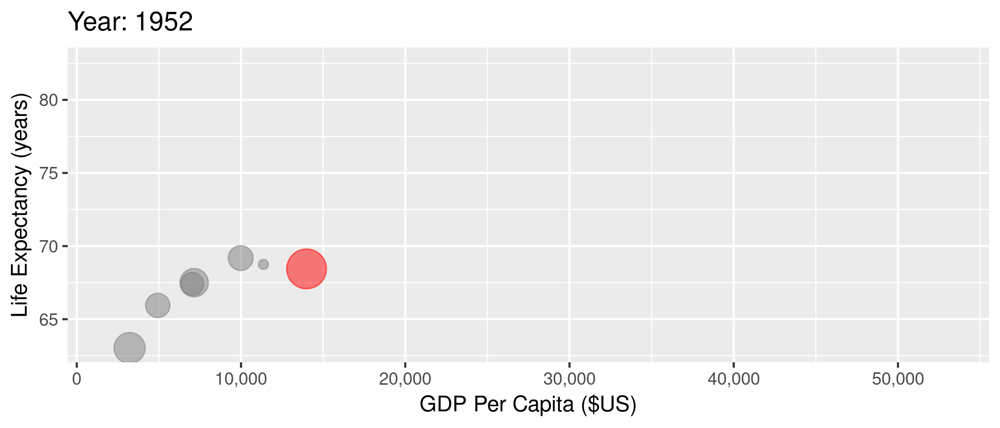

<!-- Adjust some CSS code for font size, maintain R code font size -->
<style type="text/css">
.remark-slide-content {
    font-size: 30px;
    padding: 1em 2em 1em 2em;    
}
.remark-code, .remark-inline-code { 
    font-size: 20px;
}
</style>


<!-- Set R options for how code chunks are displayed and load packages -->
```{r setup, include=FALSE}
options(htmltools.dir.version = FALSE)
options(dplyr.summarise.inform = FALSE)
library(knitr)
opts_chunk$set(
  fig.align="center",  
  fig.height=3, #fig.width=6,
  # out.width="748px", #out.length="520.75px",
  dpi=300, #fig.path='Figs/',
  cache=T#, echo=F, warning=F, message=F
  )

knitr::opts_hooks$set(fig.callout = function(options) {
  if(options$fig.callout) {
    options$echo = FALSE
  }
  options
})

if (!require("pacman")) install.packages("pacman")
pacman::p_load(tidyverse, ggplot2, dplyr, lubridate, readr, readxl, hrbrthemes,
               scales, gganimate, gapminder, gifski, png, tufte, plotly, OECD,
               ggrepel, xaringanExtra)
```


```{r xaringan-scribble, echo=FALSE}
xaringanExtra::use_scribble(rgb(0.9, 0.5, 0.5))
```


# Table of contents

1. [Health and Health Care](#health)

2. [Why Study Health Care](#why)

3. [Class Overview](#class)


<!-- New Section -->
---
class: inverse, center, middle
name: health

# Health and Health Care

<html><div style='float:left'></div><hr color='#EB811B' size=1px width=1055px></html>

---
class: clear, center


???
Before we get into class details, let's discuss what's exciting and important about studying health care, particularly in the United States. The goal for this first set of slides is to get us excited about why we're here and to keep in mind the big picture.

---
# Better health

We've made *major* improvements in life expectancy (and many other measures of health) across the world

- Poverty reduction
- Technology development and innovation
- Technology diffusion and adoption
- Access to better services, including health care


???
- All of these issues are related to economic growth in general
- In the next several slides, we'll talk about the link between economics and health

---
# Better health

```{r life-exp, eval=FALSE}
library(gapminder)
gapminder %>%
  group_by(year) %>%
  summarize(lifeExp = median(lifeExp),
            gdpMed = median(gdpPercap)) %>%
  ggplot(aes(year,lifeExp)) + geom_line(alpha = 1/3) + theme_bw() +
    labs(x = "Year",
         y = "Life Expectancy (years)",
         title = "Median life expectancy across the world")
```

.plot-callout[
```{r life-exp-callout, ref.label="life-exp", fig.callout=TRUE}
```
]

???
As an aside, working with data will be a small component of this class. So I'll share some code for a lot of graphs when it is easy and reasonable to do so.


---
# Better health

```{r life-exp-full-output, ref.label="life-exp", fig.callout=TRUE}
```


???
Ok, so what? Our health has been improving over time. I guess that's good, but what does that have to do with economics? A lot...

---
# GDP and health

```{r lifexp-gdp, eval=FALSE}
library(gapminder)
ggplot(data = gapminder, mapping = aes(x = gdpPercap, y = lifeExp)) + 
  geom_point(size = 1) + theme_bw() + scale_x_continuous(label = comma) +
  labs(x = "GDP Per Capita ($US)",
       y = "Life Expectancy (years)",
       title = "Life expectancy and GDP")
```

.plot-callout[
```{r lifexp-gdp-callout, ref.label="lifexp-gdp", fig.callout=TRUE}
```
]


---
# GDP and health

```{r lifexp-full-output, ref.label="lifexp-gdp", fig.callout=TRUE}
```

???
A country's wealth is very strongly correlated with their health, or at least with many measures of health.

---
# GDP and health over time

```{r gganim1, message=FALSE, warning=FALSE, include=FALSE}
anim1 <- ggplot(gapminder, aes(gdpPercap, lifeExp, size = pop)) +
  geom_point(alpha = 0.5, show.legend = FALSE) +
  scale_colour_manual(values = country_colors) +
  scale_size(range = c(2, 12)) +
  scale_x_log10() +
  facet_wrap(~continent) +
  labs(title = 'Year: {frame_time}', x = 'Log GDP Per Capita ($US)', y = 'Life Expectancy (years)') +
  transition_time(year) +
  ease_aes('linear')

anim_save("anim1.gif",anim1,
          path="/home/imccart/Professional/Teaching/Emory/Econ-372/content/00-Introduction/pics")
```

.center[
  
]

???
This relationship between wealth and health is even more evident when we look over time by country. This makes sense if we think of ways to improve very low life expectancy (e.g., life expectancy cut due to lack of basic necessities like food, shelter, clean water, basic medicine, etc.). But conditional on a relatively high life expectancy, the link between economic performance and life expectancy isn't so clear. The U.S. is a good example.


---
# But the U.S. is unique

```{r us-gap, message=FALSE, warning=FALSE, include=FALSE}
mycolors <- c("US" = "red", "other" = "grey50")
anim2 <- gapminder %>% filter(country %in% c("Canada", "France", "Germany", "Italy", "Japan", "United Kingdom", "United States")) %>%
  mutate(highlight = ifelse(country=="United States", "US", "other")) %>%
  ggplot(aes(gdpPercap, lifeExp, size = pop)) +
  geom_point(alpha = 0.5, show.legend = FALSE, aes(color=highlight)) +
  scale_color_manual("U.S.", values = mycolors) +
  scale_size(range = c(2, 12)) +
  scale_x_comma(limits=c(0,55000)) + 
  labs(title = 'Year: {frame_time}', x = 'GDP Per Capita ($US)', y = 'Life Expectancy (years)') +
  transition_time(year) +
  ease_aes('linear')

anim_save("anim2.gif",anim2,
          path="/home/imccart/Professional/Teaching/Emory/Econ-372/content/00-Introduction/pics")
```

.center[
  
]

???
- So life expectancy and other health outcomes have improved globally
- Health tends to improve as wealth increases
- But the U.S. seems to be underperforming at least in some easily measurable quality outcomes...our economy continues to grow even while our life expectancy flattens out, or even decreasing in recent years!


---
# Health care spending

```{r include=FALSE}
search_dataset("health",get_datasets())
oecd.str1 <- get_data_structure("SHA")
oecd.str2 <- get_data_structure("HEALTH_STAT")
oecd.exp <- get_dataset("SHA", filter=list("HFTOT", "HCTOT", "HPTOT", "PARPIB"))
oecd.health <- get_dataset("HEALTH_STAT", filter=list(c("MATIINFA","MATIMATM")))

health.dat <- oecd.health %>%
  filter(COU %in% c("USA", "GBR", "CAN", "FRA", "DEU", "ITA", "JPN")) %>%
  select(VAR, year = obsTime, value = obsValue, country = COU)
health.dat <- pivot_wider(health.dat, id_cols = c("year", "country"),
                          names_from = VAR, 
                          values_from = value) %>%
  rename(mort_inf = MATIINFA, mort_mat = MATIMATM)

exp.dat <- oecd.exp %>%
  filter(LOCATION %in% c("USA", "GBR", "CAN", "FRA", "DEU", "ITA", "JPN")) %>%
  select(year = obsTime, tot_exp = obsValue, country = LOCATION)

oecd.dat <- health.dat %>%
  left_join(exp.dat, by=c("year", "country")) %>%
  mutate(year=as.integer(year))

```

```{r spend, echo=FALSE, message=FALSE, warning=FALSE}
oecd.dat %>% filter(year>=1970) %>%
  ggplot(aes(x=year,y=tot_exp,color=country)) + 
  geom_line(show.legend = FALSE) + theme_bw() +
  geom_text_repel(data = oecd.dat %>% filter(year == 2014), 
            aes(label = country,
                x = year + 1,
                y = tot_exp),
            show.legend = FALSE) +
  guides(linecolor=FALSE) +
  labs(
    x="Year",
    y="Spending as Share of GDP",
    title="Health Care Spending over Time"
  ) + xlim(1970, 2017)
```

???
But we continue to spend more and more on health care! How is it that we keep spending more on health care, and we continue to be a very wealthy nation, and yet our health outcomes aren't improving as they are in other countries?

We seem to be on an entirely different health and spending gradient.


---
# Spending and infant mortality
```{r spend-inf-mort, message=FALSE, warning=FALSE, include=FALSE}
anim4 <- oecd.dat %>% filter(year>=1970) %>% group_by(country) %>% fill(c(tot_exp, mort_inf), .direction="updown") %>%
  ggplot(aes(tot_exp, mort_inf, label=country)) +
  geom_text(aes(size=3), show.legend=FALSE) + theme_bw() + 
  labs(title = 'Year: {frame_time}', x = 'Health Care Spending (%GDP)', y = 'Infant Mortality') +
  transition_time(year) +
  ease_aes('linear')
anim_save("anim4.gif",anim4,
          path="/home/imccart/Professional/Teaching/Emory/Econ-372/content/00-Introduction/pics")
```

.center[
  
]


---
# Spending and maternal mortality
```{r spend-mat-mort, message=FALSE, warning=FALSE, include=FALSE}
anim5 <- oecd.dat %>% filter(year>=1970 & year<=2012) %>% group_by(country) %>% fill(c(tot_exp, mort_mat), .direction="updown") %>%
  ggplot(aes(tot_exp, mort_mat, label=country)) +
  geom_text(aes(size=3), show.legend=FALSE) + theme_bw() + 
  labs(title = 'Year: {frame_time}', x = 'Health Care Spending (%GDP)', y = 'Maternal Mortality') +
  transition_time(year) +
  ease_aes('linear')
anim_save("anim5.gif",anim5,
          path="/home/imccart/Professional/Teaching/Emory/Econ-372/content/00-Introduction/pics")
```

.center[
  
]

---
# What does that mean?

- Are we just woefully inefficient?
- The right answer is probably more complicated
  - U.S. very good in some areas (breast cancer treatment, interventional cardiology)
  - Let's look at some more graphs from the [Commonwealth Fund](https://www.commonwealthfund.org/publications/issue-briefs/2020/jan/us-health-care-global-perspective-2019)


???
-Quick Zoom poll: Do you agree or disagree with this statement? The US spends more than any other developed country on health care for worse outcomes.

-Major takeaway from these commonwealth fund graphs...we have an "access" problem in the U.S. In many ways, we "overprovide" care to some people and underprovide care to lots of other people. We are particularly bad at helping the least healthy among us. These issues are, of course, very closely related to other economic problems and inequality in general.


<!-- New Section -->
---
class: inverse, center, middle
name: why

# Why Study Health Care?

<html><div style='float:left'></div><hr color='#EB811B' size=1px width=1055px></html>


---
# Why study U.S. health care

1. Health and health care are constantly changing

2. Health expenditures in 2020: <span>&#36;</span>4.1 trillion, 19.7% of GDP, <span>&#36;</span>12,530 per person (from [NHE Fact Sheet](https://www.cms.gov/Research-Statistics-Data-and-Systems/Statistics-Trends-and-Reports/NationalHealthExpendData/NHE-Fact-Sheet))

3. U.S. health care is uniquely inefficient in many ways

--

> *"Nobody knew health care could be so complicated"*
> `r tufte::quote_footer('-- Donald Trump')`


---
# Health care and economics (in general)

Lots of interesting economic issues in health care (not all unique to the U.S.):

--

1. Extremely heterogeneous products
2. Asymmetric information between patients and physicians
3. Unobservable quality (experience good)
4. Unpredictable need (inability to shop in many cases)
5. Distortion of incentives due to insurance
6. Adverse selection (asymmetric information between patients and insurers)

???
Can you list some ways that the U.S. health care system is "unique" as an area of economic study?

---
# How is the U.S. unique?

- These factors exist in other markets and in other countries, but...
- Health care is unique in the combination of these issues
- U.S. is unique in the extent of these issues in health care (policy problems)


---
# Why such high spending in the U.S.?

Can you identify one or two reasons for our high prices/expenditures? Keep in mind we don't have a particularly strong quality advantage either.


???
- Do this as a zoom poll: What do you think is the biggest driver of spending? Too much care? Overpaid physicians? Less healthy population?

---
class: clear, center

<br>

<iframe width="600" height="350" src="https://www.youtube.com/embed/qSjGouBmo0M" frameborder="0" allow="accelerometer; autoplay; encrypted-media; gyroscope; picture-in-picture" allowfullscreen></iframe>


???
We saw some of these same ideas in the commonwealth fund graphs. For example, we saw in those graphs that we don't clearly use more health care than in other countries

---
# Fragmentation

A common criticism of U.S. health care is that it is extremely fragmented:
- different ways to get insurance
- mix of providers and reliance on referrals
- separate billing (for the most part)

---
# Complicated bills
Our fragmented system has led to a ridiculously complex and convoluted billing process

--

.center[
  
]

<div class="smalltext">Brill, Steven. 2013. "Bitter Pill: Why Medical Bills are Killing Us." *Time Magazine*.</div>


???
How much is an accu-chek test strip on Amazon? Give everyone time to look it up.

---
# Complicated bills
- $18 for accu-chek test strip (in 2011)
- Can get 50 for $11.44 on Amazon<br>

--
<br>

Note: this $18 is a charge, which is different from price or cost...much more on this later


---
# What did we learn from all of this?

1. We spend *LOTS* on health care, the most in the world by far
2. Definitely not the highest quality health care system in the world
3. Many reasons:
  - Standard health economics issues
  - Fragmented system
  - Market-based system but without real competition
  - Policy failures
4. What's the solution?<br>

--

Take this class!!


<!-- New Section -->
---
class: inverse, center, middle
name: class

# Class Overview

<html><div style='float:left'></div><hr color='#EB811B' size=1px width=1055px></html>


---
# Details of this class

Now, let's go into more detail on "what" specifically we'll try to learn this semester, and "how" we'll try to learn it.


---
# Goals

1. Explain the structure of the U.S. health care system, its main components, and its history
2. Model adverse selection in health insurance, examine its effects on health insurance markets, and support your arguments with existing data
3. Explain the physician agency problem, use a model of physician agency to examine financial incentives in health care, and summarize empirical evidence on the presence of physician agency
4. Describe hospital pricing, negotiation with insurers, and explain (qualitatively and quantitatively) the differences between charges and prices
5. Analyze hospital data in a real-life setting and predict effects of real-life policies


---
# Structure

Course designed to follow someone through our health care system.

1. Choose an insurance plan (we'll study insurance and insurance markets)

2. Select a provider (we'll study agency problems and financial incentives)

3. Receive hospital care (we'll study hospital behaviors, pricing, and competition)


---
# Materials

- Check the website!
- I'll reference a couple of textbooks, but they aren't required
- All readings and supplemental materials listed on the content page of our class website
- Materials available for download on Canvas

---
# Assignments

Assessment in 4 different ways:

1. Homework (3 assignments, 1 for each module)
2. Mid-term exam (covers modules 1-2)
3. Project (relates mainly to module 3 but is semester long)
4. Participation


---
# Grading

 Component     | Points   | Weight
 --------------| ---------| ------------
 Homework (x3) | 180      | 45% 
 Mid-term      | 60       | 15%
 Project       | 140      | 35%
 Participation | 20       | 5% 

---
# Office hours

- **Official** office hours are Monday and Wednesday, 2:30 to 3:30
- PAIS 573, but Zoom is an option
--

- **Unofficial** office hours (nearly) anytime!
- Just book a time on my appointments page on our website


---
# Contact me

Please, please, please talk to me!

.center[
  
]


---
count: false

# Contact me

- Drop by during office hours
- Schedule a quick chat
- Email (usually respond within 24 hours)
- Happy to grab a coffee and meet in person 

---
# Expectations

- This is an <b>economics</b> class first
- Need some calculus to think things through formally
  - Nothing more than derivatives
  - For review, see the practice problems on the class resources page
  - If you can do those reviews, you're in good shape
--

- This is a challenging class, but we will do it and we'll learn a lot along the way!


---
class: clear, center


