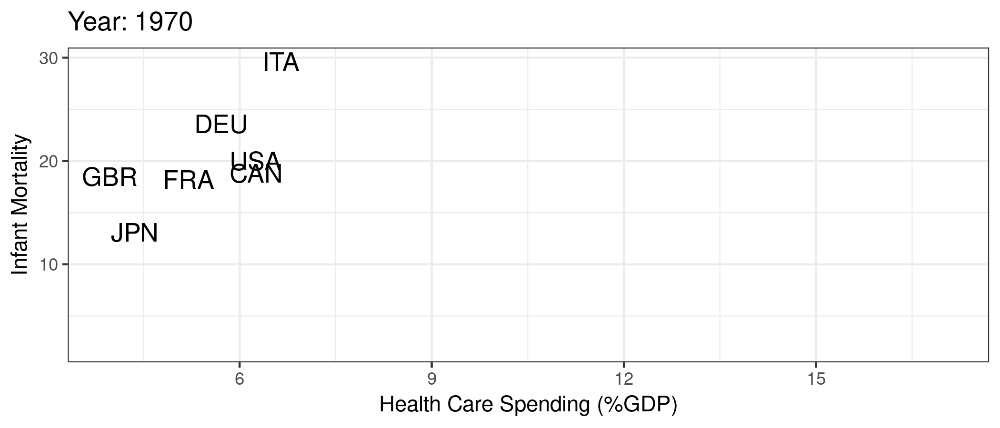
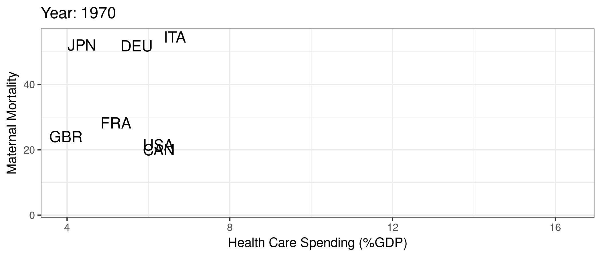

<!-- Adjust some CSS code for font size, maintain R code font size -->
<style type="text/css">
.remark-slide-content {
    font-size: 30px;
    padding: 1em 2em 1em 2em;    
}
.remark-code, .remark-inline-code { 
    font-size: 20px;
}
</style>


<!-- Set R options for how code chunks are displayed and load packages -->
```{r setup, include=FALSE}
options(htmltools.dir.version = FALSE)
options(dplyr.summarise.inform = FALSE)
library(knitr)
opts_chunk$set(
  fig.align="center",  
  fig.height=3, #fig.width=6,
  # out.width="748px", #out.length="520.75px",
  dpi=300, #fig.path='Figs/',
  cache=T#, echo=F, warning=F, message=F
  )

knitr::opts_hooks$set(fig.callout = function(options) {
  if(options$fig.callout) {
    options$echo = FALSE
  }
  options
})

if (!require("pacman")) install.packages("pacman")
pacman::p_load(tidyverse, ggplot2, dplyr, lubridate, readr, readxl, hrbrthemes,
               scales, gganimate, gapminder, gifski, png, tufte, plotly, OECD,
               ggrepel)
```

# Health and Health Care

<br>
.center[
  
]

---
# Health and Health Care

We've made *major* improvements in life expectancy (and many other measures of health) across the world

- Poverty reduction
- Technology development and innovation
- Technology diffusion and adoption
- Access to better services, including health care


???
- In the next several slides, we'll talk about the link between economics and health

---
# Evidence of better health

```{r life-exp, eval=FALSE}
library(gapminder)
gapminder %>%
  group_by(year) %>%
  summarize(lifeExp = median(lifeExp),
            gdpMed = median(gdpPercap)) %>%
  ggplot(aes(year,lifeExp)) + geom_line(alpha = 1/3) + theme_bw() +
    labs(x = "Year",
         y = "Life Expectancy (years)",
         title = "Median life expectancy across the world")
```

.plot-callout[
```{r life-exp-callout, ref.label="life-exp", fig.callout=TRUE}
```
]


---
# Evidence of better health

```{r life-exp-full-output, ref.label="life-exp", fig.callout=TRUE}
```


---
# GDP and Health

```{r lifexp-gdp, eval=FALSE}
library(gapminder)
ggplot(data = gapminder, mapping = aes(x = gdpPercap, y = lifeExp)) + 
  geom_point(size = 1) + theme_bw() + scale_x_continuous(label = comma) +
  labs(x = "GDP Per Capita ($US)",
       y = "Life Expectancy (years)",
       title = "Life expectancy and GDP")
```

.plot-callout[
```{r lifexp-gdp-callout, ref.label="lifexp-gdp", fig.callout=TRUE}
```
]


---
# GDP and Health

```{r lifexp-full-output, ref.label="lifexp-gdp", fig.callout=TRUE}
```


---
# GDP and Health over Time

```{r gganim1, message=FALSE, warning=FALSE, include=FALSE}
anim1 <- ggplot(gapminder, aes(gdpPercap, lifeExp, size = pop)) +
  geom_point(alpha = 0.5, show.legend = FALSE) +
  scale_colour_manual(values = country_colors) +
  scale_size(range = c(2, 12)) +
  scale_x_log10() +
  facet_wrap(~continent) +
  labs(title = 'Year: {frame_time}', x = 'Log GDP Per Capita ($US)', y = 'Life Expectancy (years)') +
  transition_time(year) +
  ease_aes('linear')

anim_save("anim1.gif",anim1,
          path="/home/imccart/Professional/Teaching/Emory/Econ-372/content/00-Introduction/pics")
```

.center[
  
]

???
The "economy" seems to be very closely related to health. This makes sense if we think of ways to improve very low life expectancy (e.g., life expectancy cut due to lack of basic necessities like food, shelter, clean water, basic medicine, etc.). But conditional on a relatively high life expectancy, the link between economic performance and life expectancy isn't so clear. The U.S. is a good example.


---
# But the US is unique
```{r us-gap, message=FALSE, warning=FALSE, include=FALSE}
mycolors <- c("US" = "red", "other" = "grey50")
anim2 <- gapminder %>% filter(country %in% c("Canada", "France", "Germany", "Italy", "Japan", "United Kingdom", "United States")) %>%
  mutate(highlight = ifelse(country=="United States", "US", "other")) %>%
  ggplot(aes(gdpPercap, lifeExp, size = pop)) +
  geom_point(alpha = 0.5, show.legend = FALSE, aes(color=highlight)) +
  scale_color_manual("U.S.", values = mycolors) +
  scale_size(range = c(2, 12)) +
  scale_x_comma(limits=c(0,55000)) + 
  labs(title = 'Year: {frame_time}', x = 'GDP Per Capita ($US)', y = 'Life Expectancy (years)') +
  transition_time(year) +
  ease_aes('linear')

anim_save("anim2.gif",anim2,
          path="/home/imccart/Professional/Teaching/Emory/Econ-372/content/00-Introduction/pics")
```

.center[
  
]

???
- So life expectancy and other health outcomes have improved globally
- But the U.S. seems to be underperforming at least in some easily measurable quality outcomes...our economy continues to grow even while our life expectancy flattens out (even decreasing in recent years)


---
# Health care spending
```{r include=FALSE}
search_dataset("health",get_datasets())
oecd.str1 <- get_data_structure("SHA")
oecd.str2 <- get_data_structure("HEALTH_STAT")
oecd.exp <- get_dataset("SHA", filter=list("HFTOT", "HCTOT", "HPTOT", "PARPIB"))
oecd.health <- get_dataset("HEALTH_STAT", filter=list(c("MATIINFA","MATIMATM")))

health.dat <- oecd.health %>%
  filter(COU %in% c("USA", "GBR", "CAN", "FRA", "DEU", "ITA", "JPN")) %>%
  select(VAR, year = obsTime, value = obsValue, country = COU)
health.dat <- pivot_wider(health.dat, id_cols = c("year", "country"),
                          names_from = VAR, 
                          values_from = value) %>%
  rename(mort_inf = MATIINFA, mort_mat = MATIMATM)

exp.dat <- oecd.exp %>%
  filter(LOCATION %in% c("USA", "GBR", "CAN", "FRA", "DEU", "ITA", "JPN")) %>%
  select(year = obsTime, tot_exp = obsValue, country = LOCATION)

oecd.dat <- health.dat %>%
  left_join(exp.dat, by=c("year", "country")) %>%
  mutate(year=as.integer(year))

```

```{r spend, echo=FALSE, message=FALSE, warning=FALSE}
oecd.dat %>% filter(year>=1970) %>%
  ggplot(aes(x=year,y=tot_exp,color=country)) + 
  geom_line(show.legend = FALSE) + theme_bw() +
  geom_text_repel(data = oecd.dat %>% filter(year == 2014), 
            aes(label = country,
                x = year + 1,
                y = tot_exp),
            show.legend = FALSE) +
  guides(linecolor=FALSE) +
  labs(
    x="Year",
    y="Spending as Share of GDP",
    title="Health Care Spending over Time"
  ) + xlim(1970, 2017)
```

???
But we continue to spend more and more on health care!


---
# Spending and infant mortality
```{r spend-inf-mort, message=FALSE, warning=FALSE, include=FALSE}
anim4 <- oecd.dat %>% filter(year>=1970) %>% group_by(country) %>% fill(c(tot_exp, mort_inf), .direction="updown") %>%
  ggplot(aes(tot_exp, mort_inf, label=country)) +
  geom_text(aes(size=3), show.legend=FALSE) + theme_bw() + 
  labs(title = 'Year: {frame_time}', x = 'Health Care Spending (%GDP)', y = 'Infant Mortality') +
  transition_time(year) +
  ease_aes('linear')
anim_save("anim4.gif",anim4,
          path="/home/imccart/Professional/Teaching/Emory/Econ-372/content/00-Introduction/pics")
```

.center[
  
]


---
# Spending and maternal mortality
```{r spend-mat-mort, message=FALSE, warning=FALSE, include=FALSE}
anim5 <- oecd.dat %>% filter(year>=1970 & year<=2012) %>% group_by(country) %>% fill(c(tot_exp, mort_mat), .direction="updown") %>%
  ggplot(aes(tot_exp, mort_mat, label=country)) +
  geom_text(aes(size=3), show.legend=FALSE) + theme_bw() + 
  labs(title = 'Year: {frame_time}', x = 'Health Care Spending (%GDP)', y = 'Maternal Mortality') +
  transition_time(year) +
  ease_aes('linear')
anim_save("anim5.gif",anim5,
          path="/home/imccart/Professional/Teaching/Emory/Econ-372/content/00-Introduction/pics")
```

.center[
  
]


---
# Why study U.S. health care

1. Health and health care are constantly changing

2. Health expenditures in 2019: <span>&#36;</span>3.8 trillion, 17.7% of GDP, <span>&#36;</span>11,582 per person (from [NHE Fact Sheet](https://www.cms.gov/Research-Statistics-Data-and-Systems/Statistics-Trends-and-Reports/NationalHealthExpendData/NHE-Fact-Sheet))

3. U.S. health care is uniquely inefficient in many ways

--

> *"Nobody knew health care could be so complicated"*
> `r tufte::quote_footer('-- Donald Trump')`
